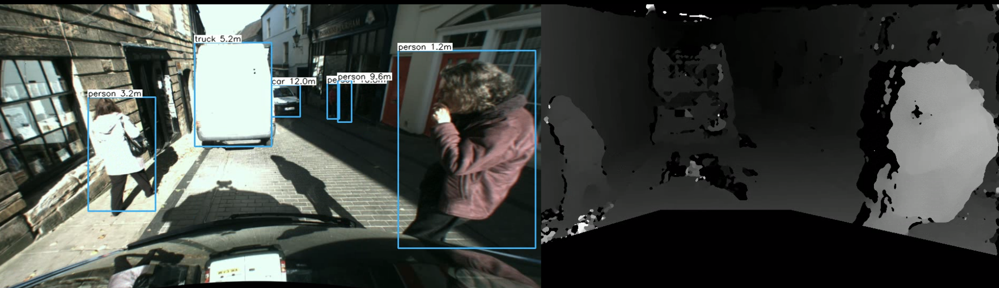

# Object detection with dense stereo distance estimation

See **report.pdf** for more details.

# Setup

First, please download these files:
https://pjreddie.com/media/files/yolov3.weights
https://github.com/pjreddie/darknet/blob/master/cfg/yolov3.cfg?raw=true
https://github.com/pjreddie/darknet/blob/master/data/coco.names?raw=true

and save them in the same directory as stereo_disparity.py as yolov3.weights, yolov3.cfg and coco.names exactly.

Make sure you have the TTBB dataset, and edit the variable path_to_dataset at the top of the file to where it is on your system.

To run the script, it's "python3 stereo_disparity.py"
